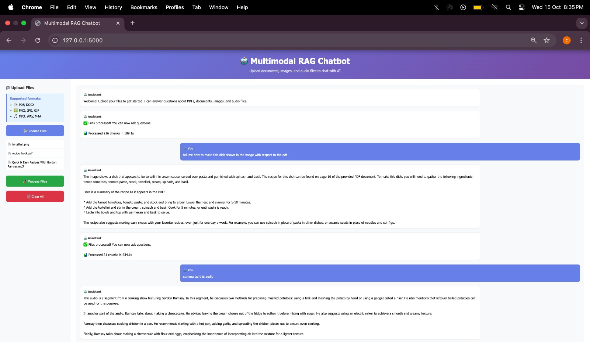
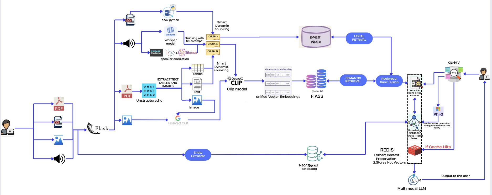

# 🤖 Multimodal RAG System - Offline Intelligence Platform

## A production-ready multimodal RAG system that ingests, indexes, and queries diverse data formats (PDF, DOCX, Images, Audio) using advanced AI techniques - completely OFFLINE.

### 🎯 Overview
This project solves a critical challenge: cross-format semantic search across documents, images, screenshots, and audio recordings. Traditional search tools isolate different data types, but our Retrieval-Augmented Generation (RAG) system creates a unified semantic space where all modalities can be searched, compared, and understood together.

### Problem Statement
Organizations routinely handle diverse data types (PDF, DOCX, Images, Screenshots, Recorded Calls, Notes). Traditional search tools struggle with:

- Cross-format understanding
- Semantic relationships between different modalities
- Contextual retrieval across text, images, and audio
- Grounded, citation-backed answers


### Our Solution
A 100% offline multimodal RAG system that:

- ✅ Ingests multimodal inputs (DOCX/PDF/Images/Audio)
- ✅ Indexes all modalities in a shared vector space
- ✅ Supports natural language queries across all formats
- ✅ Generates grounded summaries with citations
- ✅ Establishes cross-format links (audio ↔ text ↔ images)

### 🎬 Demo
Web Interface



### Terminal Interface


```
$ python ragchatbot.py

🤖 CROSS-MODAL MULTIMODAL RAG CHATBOT
======================================================================
Model: llava:7b
Index: processed_output/multimodal_index.bin

🎯 Supported Query Modes:
   ✅ Text → Text, Images, Audio, Tables
   ✅ Image → Similar Images + Related Content
   ✅ Audio → Related Transcripts + Content
   ✅ Multi-modal → Fused Results

🔍 Your query: What are the Q4 revenue numbers?

🔍 Searching (Hybrid: Semantic + BM25 + Reranking)...
   ✓ Retrieved 10 results

📊 Retrieved:
   Text chunks: 3
   Tables: 2
   Images: 1 (1 with files)
   Audio: 0

🤖 ANSWER:
Based on the Q4 financial table (Table 2.1), the revenue numbers are:
- **Total Revenue**: $45.3M (up 23% YoY)
- **Product Sales**: $32.1M  
- **Services**: $13.2M

The growth was driven primarily by enterprise segment expansion...
[Source: quarterly_report_2024.pdf, Table 2.1]

```

### 🚀 Installation
Prerequisites

- Python: 3.8 or higher
- Ollama: For LLM inference (Install Ollama)
- Tesseract OCR: For image text extraction

#### Step 1: Clone Repository

```
git clone https://github.com/BayesianDecoder/SIH-HACKATHON---SIH25231
```

#### Step 2: Install Dependencies

```
pip install -r requirements.txt
```
#### Step 3: Download Models
```
## Download CLIP model (for embeddings)

python -c "from sentence_transformers import SentenceTransformer; SentenceTransformer('clip-ViT-B-32')"
```

#### Download LLaVA model (for generation)
```
ollama serve

# In new terminal
ollama pull llava:7b
```
#### Download Cross-Encoder (for reranking)
```
python -c "from sentence_transformers import CrossEncoder; CrossEncoder('cross-encoder/ms-marco-MiniLM-L-6-v2')"
```
#### Step 4: Verify Installation
```
python -c "import torch; import faiss; import ollama; print('✅ All dependencies installed!')"
```

### ⚡ Quick Start

#### 1. Process Your Documents
```
# Process a directory with mixed file types
python multimodal_unified_parallel.py /path/to/your/documents \
    --output-dir processed_output \
    --workers 8
```

### Expected output:

```
🚀 PARALLEL MULTIMODAL RAG PIPELINE
 ======================================================================
 Found: 15 files
    PDFs: 5
    DOCX: 3  
    Images: 4
    Audio: 3

 ⚡ PARALLEL PROCESSING ALL TYPES SIMULTANEOUSLY
 [████████████████████████████] 100%

 ✅ PARALLEL PIPELINE COMPLETE!
 Duration: 45.2s
 Total Chunks: 342
 Speed: 7.6 chunks/second

```
#### 2. Launch Web Interface
```
# Start Flask server
python app1.py

# Access at: http://localhost:5000

```
#### 3. Use Terminal Chatbot
```
# Interactive mode
python ragchatbot.py

```

# Command-line mode
```
python ragchatbot.py text "What is the main topic?"
python ragchatbot.py image diagram.png "Explain this chart"
python ragchatbot.py audio meeting.mp3 "Summarize the discussion"
```

### 📖 Usage
Web Interface

- Upload Files: Drag-and-drop or click to select files
- Process: Click "Process Files" (progress tracked in real-time)
- Query: Type natural language questions
- Results: Get answers with citations and source links


## ✨ Key Features

### 🔍 Advanced Search Capabilities

- Hybrid Search: Combines semantic (CLIP) + keyword (BM25) + cross-encoder reranking
- Cross-Modal Retrieval: Text query → finds relevant images, tables, audio transcripts
- Multi-Query Support: Text, Image, Audio, and Multi-modal queries
- 5-10x Faster: Parallel processing for all file types

### 📄 Document Processing

- PDF: Extracts text, tables, images with 5-sentence context windows
- DOCX: LLM-friendly table formatting + OCR for embedded images
- Images: Advanced OCR, screenshot detection, CLIP embeddings
- Audio: Automatic speaker diarization (librosa MFCC + KMeans), Whisper transcription

### 🧠 AI-Powered Intelligence

- LLaVA Vision Model: Analyzes images directly (not just OCR)
- CLIP Embeddings: Unified semantic space for all modalities
- Cross-Encoder Reranking: Superior result quality
- Citation Transparency: Every answer cites exact sources

### 🌐 User Experience

- Web Interface: Clean, intuitive Flask-based UI
- Interactive CLI: Terminal-based chatbot mode
- Real-time Processing: Live progress tracking
- Multi-file Support: Batch upload and processing

## Architecture



### Future Enhancements (Planned)

Planned features include:

- Enhanced Entity Extraction: NEO4j graph database for relationships
- Redis Caching: Hot vector storage for frequently accessed content
- Smart Context Preservation: Advanced conversation memory
- Phi-3 Integration: Improved answer quality with local small models
